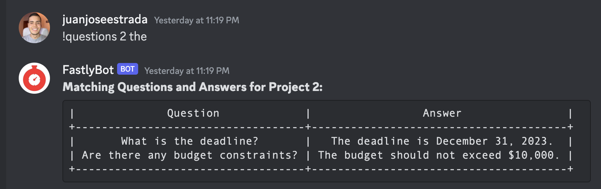
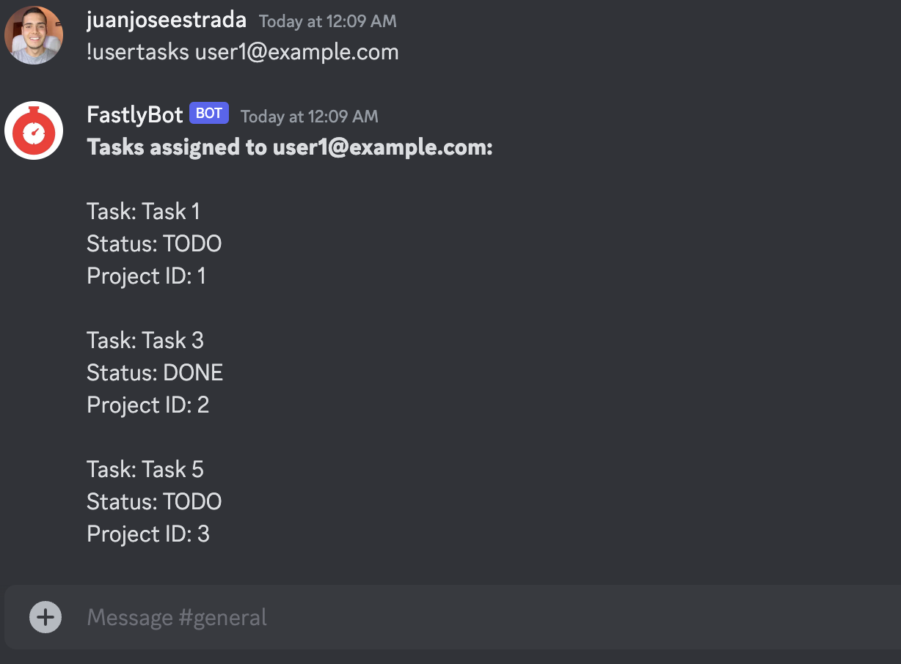
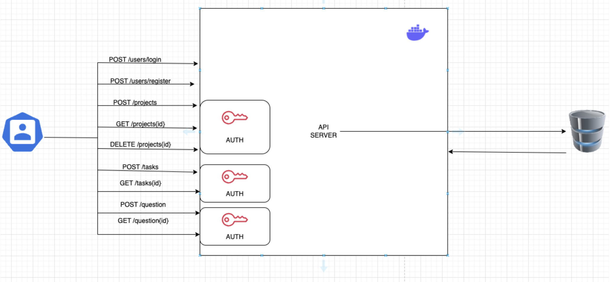
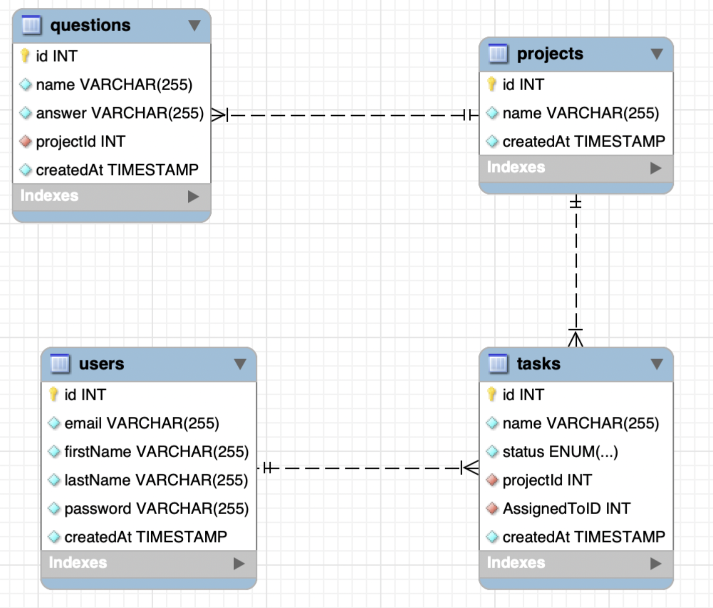

# Chatbot with API Gateway🤖🚪

This project features a chatbot system where the backend API gateway is implemented in Go, and the chatbot interface is developed in Python. The API gateway handles requests and routes them to the appropriate services, while the chatbot interface interacts with users and processes their inputs.
## Insipiration 🤗
This project was inspired by the recruiting interviews for a summer internship at Fastly. Although I received an offer from Fastly, I chose to pursue another internship opportunity at a national lab.

## Introduction🙌

Welcome to the Fastly RecruitRover API – a hiring assistant designed to transform the candidate experience at Fastly. This API is the central nerve system that orchestrates a seamless interaction between job applicants and the company’s recruitment process, ensuring efficiency and engagement every step of the way.





Built with Go, our API is composed of several microservices that handle distinct facets of the recruitment journey:
## System Architecture🏋️

### User Service:
 Manages candidate profiles, from creating new applicant entries to authenticating users and maintaining their data throughout the hiring pipeline.
### Project Service:🐢
 Oversees the structured timeline of the hiring process, defining clear stages and milestones for candidates to follow.
Task Service: Assigns actionable items to applicants, tracks progress, and provides updates, keeping everyone in sync with the interview schedule.
### Questions Service:
Acts as a responsive knowledge hub, instantly fielding questions from candidates about the hiring process and providing accurate, helpful information.

## Purpose🦸‍♂️

Fastly RecruitRover's API goal is to make conversations smoother between candidates going through the hiring process and our team.

## Database Architecture



## Installation👾

Before you begin, make sure you have [Go](https://golang.org/dl/) installed on your system.

### Setting Up the Project

1. **Clone the repository**:
```bash
# Step 1: Clone the repository
git clone https://github.com/jjestrada2/FastlyAPI
```
# Step 2: Install dependencies
```bash
go mod download
```
# Step 3: Start the project
```bash
make run 
```
## Usage🎮

Start the API gateway server (from the api-gateway-go/ directory).
Run the chatbot interface (from the chatbot-python/ directory).
The chatbot interface will send requests to the API gateway, which will route them to the appropriate service.


## License📜

This project is licensed under the MIT License - see the [LICENSE](https://choosealicense.com/licenses/mit/) file for details.

## Credits🔥

- [Juan Estrada](https://github.com/jjestrada2) - Developer of this project.

## Contact🦻

For support or inquiries, please contact [Juan Estrada](mailto:juan5801331@gmail.com).
